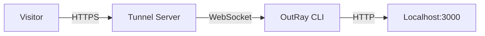

OutRay is designed to be simple yet robust.

## High-Level Overview

The OutRay system consists of three main components:

1.  **The Client (CLI)**: Runs on your local machine.
2.  **The Tunnel Server**: Runs in the cloud (or your server) and acts as the bridge.
3.  **The Web Dashboard**: Manages users, organizations, and configurations.

## Connection Flow

1.  **Initialization**: When you run `outray 3000`, the CLI initiates a WebSocket connection to the Tunnel Server.
2.  **Authentication**: The server verifies your identity using the token provided during login or via the `--key` flag.
3.  **Tunnel Establishment**: Once authenticated, the server assigns a public URL (e.g., `https://random.tunnel.outray.app`) to your connection.
4.  **Request Handling**:
    - A visitor accesses the public URL.
    - The Tunnel Server receives the request.
    - The server forwards the request payload over the WebSocket connection to the CLI.
    - The CLI proxies the request to your local server (e.g., `localhost:3000`).
    - Your local server responds.
    - The CLI sends the response back through the WebSocket to the Tunnel Server.
    - The Tunnel Server sends the response to the visitor.

## Security

- **Encryption**: All traffic between the CLI and the Tunnel Server is encrypted using TLS (WSS).
- **Isolation**: Each tunnel is isolated. Traffic meant for one tunnel cannot be routed to another.
- **Authentication**: Tunnels are tied to user accounts or API keys, preventing unauthorized usage of your resources.
